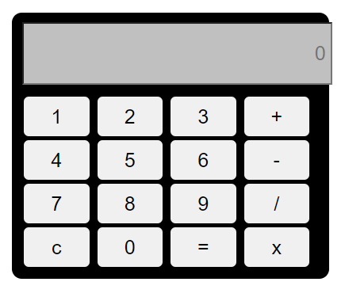

# calculator
An interactive web-based calculator built with HTML, CSS, and JavaScript. This project demonstrates dynamic UI updates and robust arithmetic functionalities, including addition, subtraction, multiplication, and division.  

